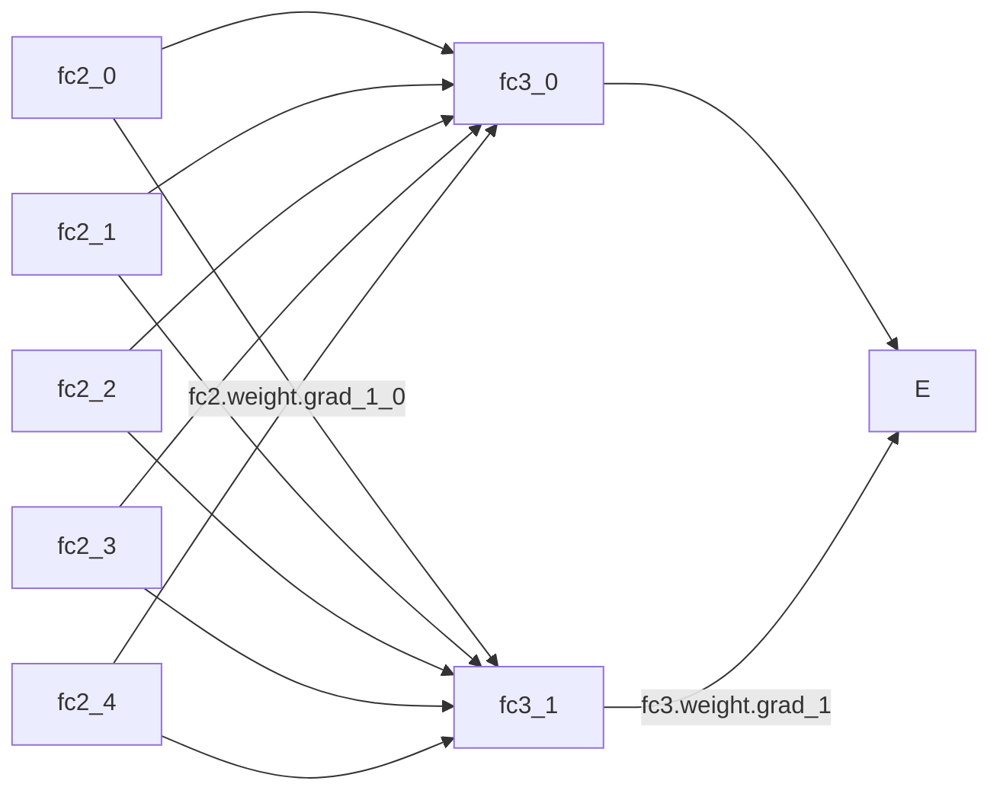

<div class="message">
안드레이 카파시는 Yes you should understand backprop라는 글에서 역전파<sup>backpropagation</sup> 코드를 직접 구현해보라고 한다. 뉴럴넷을 잘 만들려면 직접 정방향, 역방향 코드를 만들어볼 수 있어야 하며 역전파를 구현해보면 잘못된 값으로 기울기가 0이 되는 문제도 찾아낼 수 있기 때문. 실제로 역전파는 뉴럴넷을 이해하는데도 큰 도움이 되며, 역전파는 뉴럴넷의 핵심을 이룬다.
</div>

<small>
*2022년 4월 29일 그래디언트 재계산*  
*2018년 5월 24일 편집*  
*2018년 2월 11일 초안 작성*
</small>

<!-- TOC -->

- [내용](#내용)
  - [역전파<sup>backpropagation</sup> 계산](#역전파supbackpropagationsup-계산)
    - [연쇄 법칙<sup>chain rule</sup>](#연쇄-법칙supchain-rulesup)
    - [델타 룰<sup>delta rule</sup>](#델타-룰supdelta-rulesup)
    - [주피터 노트북](#주피터-노트북)
  - [히든 레이어의 역전파](#히든-레이어의-역전파)
  - [PyTorch를 이용한 그래디언트 재계산](#pytorch를-이용한-그래디언트-재계산)
- [참고](#참고)

<!-- /TOC -->

## 내용
[Yes you should understand backprop](https://medium.com/@karpathy/yes-you-should-understand-backprop-e2f06eab496b)

> 역전파 코드를 직접 만들어 봐야할 이유가 지적 호기심이나 더 나은 역전파 알고리즘을 만들기 위해서가 아니라 역전파를 알아야 뉴럴 네트워크를 만들 때 오류를 범하지 않고 디버깅을 하는데 도움을 주기 때문입니다.  
[역전파, 직접 짜봐야 하나요?](https://tensorflow.blog/2016/12/27/%EC%97%AD%EC%A0%84%ED%8C%8C-%EC%A7%81%EC%A0%91-%EC%A7%9C%EB%B4%90%EC%95%BC-%ED%95%98%EB%82%98%EC%9A%94/)

### 역전파<sup>backpropagation</sup> 계산
에러 $$E$$를 SSE로 정의하고, 각각의 가중치 $$W$$를 $$w_{jk}$$로 정의할때, $$w_{jk}$$에 대한 에러 $$E$$의 편미분은 아래와 같다.

$$\frac{\partial{E}}{\partial{w_{jk}}}=\frac{\partial}{\partial{w_{jk}}}(t_k-o_k)^2$$

여기에 미분의 연쇄 법칙<sup>chain rule</sup>을 적용한다.

$$\frac{\partial{E}}{\partial{w_{jk}}}=\frac{\partial{E}}{\partial{o_{k}}}\frac{\partial{o_{k}}}{\partial{w_{jk}}}$$

$$E=(t_k-o_k)^2$$이므로 아래와 같이 정리한다.

$$\frac{\partial{E}}{\partial{w_{jk}}}=-2(t_k-o_k)\frac{\partial{o_k}}{\partial{w_{jk}}}$$

$$o_k$$는 노드 $$k$$의 결과 값으로 입력 신호의 가중치 합에 시그모이드<sup>sigmoid</sup>를 적용한 것이다.

$$\frac{\partial{E}}{\partial{w_{jk}}}=-2(t_k-o_k)\frac{\partial}{\partial{w_{jk}}}sigmoid(\sum_{j}w_{jk}{o_j})$$

#### 연쇄 법칙<sup>chain rule</sup>
시그모이드의 미분은 [분수 함수의 연쇄 법칙에 따라 아래와 같이 정리](https://math.stackexchange.com/a/78578)된다.


이를 $$\sigma^\prime(x)$$로 정리하면 아래와 같이 깔끔하게 정리된다.

$$\frac{\partial}{\partial{x}}sigmoid(x)=sigmoid(x)(1-sigmoid(x))$$

시그모이드의 미분 결과는 매우 직관적이며, 이 점이 활성화 함수로 인기 있는 이유 중 하나 이기도 하다. 이제 이를 적용하면 식은 아래와 같다.

$$\frac{\partial{E}}{\partial{w_{jk}}}=-2(t_k-o_k){sigmoid(\sum_{j}w_{jk}{o_j})}(1-sigmoid(\sum_{j}w_{jk}{o_j}))\frac{\partial}{\partial{w_{jk}}}(\sum_{j}w_{jk}{o_j})$$

미분의 연쇄 법칙에 따라 $$f(g(x))$$를 미분하면 $$f'(g(x))g'(x)$$가 된다. 시그모이드 함수내의 표현식도 한 번 더 미분되어야 하며, 노드 $$j$$의 결과 $$o_j$$는 오직 이와 연결되는 가중치 $$w_{jk}$$에 의해서만 영향을 받으므로 합 기호를 뗄 수 있고, 미분을 취하면 $$o_j$$만 남는다. 

따라서, 아래와 같이 정리된다.

$$\frac{\partial{E}}{\partial{w_{jk}}}=-2(t_k-o_k){sigmoid(\sum_{j}w_{jk}{o_j})}(1-sigmoid(\sum_{j}w_{jk}{o_j})){o_j}$$

상수항 2를 $$\frac{1}{2}$$을 취해 제거한다. 이렇게 미분 계산을 쉽게 하기 위해 일반적으로 SSE에 $$\frac{1}{2}$$를 취한 형태를 에러 함수로 사용한다.

이제 최종 수식은 아래와 같다.

$$\frac{\partial{E}}{\partial{w_{jk}}}=-(t_k-o_k){sigmoid(\sum_{j}w_{jk}}{o_j})(1-sigmoid(\sum_{j}w_{jk}{o_j})){o_j}$$

#### 델타 룰<sup>delta rule</sup>
학습률<sup>learning rate</sup>을 포함한 $$\Delta{w}_{jk}$$의 수식을 단순화한 최종 형태는 아래와 같다. (신경망 첫걸음, 2016) [델타 룰](https://en.wikipedia.org/wiki/Delta_rule)이라 부른다.


#### 주피터 노트북
[주피터 노트북에서 미분 계산](https://nbviewer.jupyter.org/github/likejazz/jupyter-notebooks/blob/master/data-science/linear-algebra-transpose-differential.ipynb)을 직접 정리했다.

### 히든 레이어의 역전파
히든 레이어의 경우 이전 레이어의 미분을 모두 적용해야 하므로 좀 더 복잡하다. 행렬 연산이 반드시 필요한 이유이기도 한다. 여기서는 행렬의 전치<sup>transpose</sup>로 미분 계산을 진행한다.


그래디언트 체킹<sup>gradient checking</sup>이 가능하려면 $$\frac{\partial{E}}{\partial{w_1}}$$를 정확히 계산해주어야 하는데, 계산을 간편히 한다는 이유로 생략하면 수치 미분과 해석적 미분 값이 동일하지 않아 검증이 어려운 문제가 있다.


[역전파 계산을 알기쉽게 정리](https://mattmazur.com/2015/03/17/a-step-by-step-backpropagation-example/)한 글을 보면 $$\delta_o$$를 산출하면서 간단히 정리해버려 마치 미분 없이 그대로 넘기면 되는걸로 혼동할 수 있는데, 출력 레이어에 활성화<sup>activation</sup> 함수를 적용 했고 $$\delta_o$$ 계산시 에러에 대한 출력 레이어 편미분이 필요하므로 활성화, 이 경우 시그모이드 미분이 필요하다. 위 수식에서 $$\frac{\partial{out_o}}{\partial{net_o}}$$ 부분이 활성화에 대한 미분이고 $$\frac{\partial{net_o}}{\partial{out_{h1}}}$$에 가중치 $$w_5$$, $$w_6$$이 포함되어 있다.


무엇보다 직접 계산하면서 값을 맞춰 보면 이해가 쉽다. 연쇄 법칙을 정리해보면 활성화, 여기서는 시그모이드 미분이 필요함을 알 수 있으며, 시그모이드의 미분인 $$sigmoid(net_o)(1 - sigmoid(net_o))$$ 를 $$\partial{E}$$에 포함해야 되며, 기존 에러 편미분과 함께 가중치를 곱해서 이전 레이어로 역전파해야 그래디언트 체킹이 성공하게 된다.

초기에 코드를 구현하면서 누락하여 출력 레이어 활성화의 미분이 적용되지 않았으나 그래도 계산 결과만 다를뿐 비율은 행 별로 동일했으며, 재밌게도 학습 또한 제대로 진행됐다. 논문에서도 실수로 수식을 빠트리는 경우가 많으며, 의도적으로 생략하는 경우도 잦으므로 주의가 필요하다.

### PyTorch를 이용한 그래디언트 재계산
가이드[^fn-guide]를 참고하여 그래디언트 재계산

[^fn-guide]: <https://pytorch.org/tutorials/beginner/blitz/neural_networks_tutorial.html>

```python
torch.manual_seed(13)
torch.set_printoptions(sci_mode=False)

class Net(nn.Module):
    def __init__(self):
        super(Net, self).__init__()

        self.fc1 = nn.Linear(4, 5)
        self.fc2 = nn.Linear(5, 2)
        self.fc3 = nn.Linear(2, 1)

    def forward(self, x):
        x = torch.relu(self.fc1(x))
        x = torch.relu(self.fc2(x))
        x = torch.sigmoid(self.fc3(x))

        return x

# 각 레이어의 출력값 확인
activation = {}

def get_activation(name):
    def hook(model, input, output):
        activation[name] = output.detach()

    return hook


net = Net()
net.fc1.register_forward_hook(get_activation('fc1'))
net.fc2.register_forward_hook(get_activation('fc2'))
net.fc3.register_forward_hook(get_activation('fc3'))

input = torch.randn(4)
output = net(input)
target = torch.tensor([1], dtype=torch.float32)

criterion = nn.MSELoss()
loss = criterion(output, target)

net.zero_grad()
loss.backward()
```

그래디언트 출력값은 다음과 같다.

```
>>> net.fc2.weight.grad
tensor([[ 0.0000,  0.0000,  0.0000,  0.0000,  0.0000],
        [-0.0369, -0.0000, -0.0000, -0.0151, -0.0600]])
>>> net.fc3.weight.grad
tensor([[ 0.0000, -0.0222]])
```



`fc3.weight.grad_1`은 다음과 같이 계산한다.

$$\Delta = loss^{\prime}\cdot sigmoid^{\prime}\cdot fc3.input_1$$

```python
# -0.02224
-2 * (1 - (0.3875)) * 0.3875 * (1 - 0.3875) * (0.0765)
```

`fc2.weight.grad_1_0`은 다음과 같이 계산한다.

$$\Delta = loss^{\prime}\cdot sigmoid^{\prime}\cdot fc3.weight_1\cdot relu^{\prime}\cdot fc2.input_0$$

```python
# -0.03687
-2 * (1 - (0.3875)) * 0.3875 * (1 - 0.3875) * 0.33015 * 1 * 0.3841
```

위 와는 별개로 멀티 노드인 경우 다음과 같은 형태로 계산한다.

$$\Delta = \frac{loss^{\prime}\cdot weight_0 + loss^{\prime}\cdot weight_1 + loss^{\prime}\cdot weight_2}{3} \cdot input_0$$

```python
# -0.0104
( \
    -2 * (1 - -0.0766) * -0.3493 + \
    -2 * (1 - -0.2679) * 0.4791 + \
    -2 * (1 -  0.0754) * -0.2662 \
) / 3 * -1.0575
```
## 참고
- 신경망 첫걸음, 2016
- [그래디언트 체킹을 계산한 주피터 노트북](https://nbviewer.jupyter.org/github/likejazz/jupyter-notebooks/blob/master/deep-learning/backpropagation.ipynb)
- [cs231n의 그래디언트 체킹 기준](http://cs231n.github.io/neural-networks-3/#gradcheck)  
계산이 정확한데도 체킹 기준을 맞추지 못한 점은 아쉬운 부분이다.
